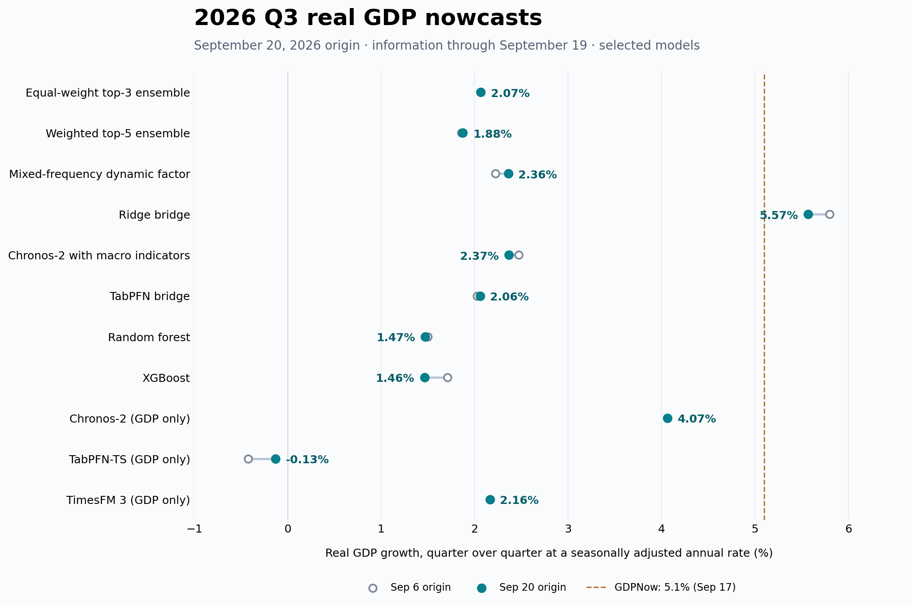

# 2026Q3 US real GDP nowcasts — September 20, 2026

All growth forecasts are **q/q SAAR percent**. The forecast origin is September 20, 2026, New York time; the information cutoff is September 19. All 32 catalog entries completed successfully. The same model specifications, feature universe and checkpoints as the September 6 run were retained.

| Model | Sep 20 | Sep 6 | Change (pp) |
|---|---:|---:|---:|
| Equal-weight top-3 ensemble | 2.07% | 2.07% | +0.00 |
| Weighted top-5 ensemble | 1.88% | 1.86% | +0.01 |
| Mixed-frequency dynamic factor | 2.36% | 2.22% | +0.14 |
| Ridge bridge | 5.57% | 5.80% | -0.23 |
| Chronos-2 with macro indicators | 2.37% | 2.47% | -0.11 |
| TabPFN bridge | 2.06% | 2.03% | +0.03 |

The ensembles are the existing project definitions: members are selected using eight earlier point-in-time validation origins. The equal-weight ensemble selects ARIMA, mean growth and AR(4), all GDP-only models. The weighted ensemble assigns ARIMA 22.74%, mean growth 22.39%, AR(4) 22.18%, random forest 16.88%, and last growth 15.80%. These ensembles therefore place most weight on GDP history. Neither is an average across all 32 entries. Differences between forecast dates include input changes, origin-dependent random seeds, and shifted ensemble validation dates; they are not a pure attribution to economic news.

## Data refresh and verification

All **46 collected series** match independent ALFRED snapshots exactly over the declared observation range from January 2005 through the cutoff. Compared with September 6, **15 series changed**, comprising **15 new observations** and **31 revised observations**. The forecast panel contains quarterly GDP and 41 monthly indicators; four auxiliary series were refreshed separately and remain outside the shared model panel.

New observations include August retail sales, industrial production, housing starts/permits, consumer/producer/trade prices; July business/wholesale inventories; and September New York/Philadelphia manufacturing surveys. Real consumption, real disposable income and international trade still stop in July. GDP history is unchanged from the prior run and ends in 2026Q2.

The Q2 real GDP denominator is **24,269.613 billion chained 2017 dollars**, as available at this cutoff. Each Q3 forecast is converted using `100 * ((Q3 forecast level / Q2 level)^4 - 1)`. Levels and annualized rates, every audit hash, nested forecast cutoffs and exported source evidence were checked against the full local evidence; the saved summary is in [validation.json](validation.json). Freshness establishes agreement with ALFRED, not complete coverage of all agency releases.

## External reference and limitations

[Atlanta Fed GDPNow](https://www.atlantafed.org/research-and-data/data/gdpnow) reports **5.1%** for 2026Q3, updated September 17. It is a reference forecast only and was not used as training data or a model-selection target. BEA schedules the [Q3 advance GDP estimate](https://www.bea.gov/news/schedule) for **October 29, 2026, at 8:30 a.m. Eastern**. No Q3 realized GDP or forecast accuracy score is available in this run.

The model spread is not a confidence interval. ISM data and some component-specific releases remain outside the panel; advance inventory series are collected but not fitted. Historical training quarters can have more complete monthly data than the current quarter. Pretrained models retain the existing checkpoint availability checks and research-use settings. Successful point-in-time validation certifies the stated information rules, not predictive accuracy.

## Full catalog

Controls and baselines are shown explicitly; the geometric-mean-level model can produce extreme negative growth and the randomized controls are not substantive economic forecasts. Drift duplicates mean growth for this complete GDP history. No all-catalog mean or median is used as a consensus estimate.

| Model | Role | Sep 20 (%) | Sep 6 (%) | Change (pp) |
|---|---|---:|---:|---:|
| `naive_last` | baseline | 0.000 | 0.000 | +0.000 |
| `last_growth` | baseline | 1.484 | 1.484 | +0.000 |
| `mean_growth` | baseline | 2.027 | 2.027 | +0.000 |
| `ar4` | model | 2.000 | 2.000 | +0.000 |
| `bridge_ridge` | model | 5.568 | 5.800 | -0.231 |
| `mean` | control | -61.656 | -61.656 | +0.000 |
| `drift` | baseline | 2.027 | 2.027 | +0.000 |
| `seasonal_naive` | control | -3.942 | -3.942 | +0.000 |
| `random_normal` | control | 1.207 | 3.003 | -1.797 |
| `random_uniform` | control | -1.494 | -15.425 | +13.931 |
| `random_permutation` | control | 34.855 | 1.291 | +33.564 |
| `auto_arima` | model | 2.177 | 2.177 | +0.000 |
| `auto_ets` | model | 2.171 | 2.171 | +0.000 |
| `theta` | model | 1.559 | 1.559 | +0.000 |
| `local_trend_ssm` | model | 2.163 | 2.163 | +0.000 |
| `random_forest` | model | 1.473 | 1.502 | -0.028 |
| `xgboost` | model | 1.465 | 1.712 | -0.247 |
| `bvar_minnesota_8` | model | 3.250 | 3.100 | +0.150 |
| `bvar_minnesota_20` | model | 4.467 | 4.539 | -0.072 |
| `bvar_minnesota_growth_8` | model | 2.272 | 2.082 | +0.189 |
| `bvar_minnesota_growth_20` | model | 4.379 | 4.424 | -0.045 |
| `factor_pca_qd` | model | 4.172 | 4.824 | -0.653 |
| `mixed_freq_dfm_md` | model | 2.361 | 2.223 | +0.137 |
| `lstm_univariate` | model | -1.684 | 1.497 | -3.181 |
| `lstm_multivariate` | model | 4.013 | 2.328 | +1.684 |
| `ensemble_avg_top3` | model | 2.068 | 2.068 | +0.000 |
| `ensemble_weighted_top5` | model | 1.876 | 1.861 | +0.015 |
| `chronos2` | model | 4.066 | 4.066 | +0.000 |
| `chronos2_covariates` | model | 2.366 | 2.472 | -0.106 |
| `tabpfn_bridge` | model | 2.061 | 2.027 | +0.033 |
| `tabpfn_ts` | model | -0.129 | -0.422 | +0.293 |
| `timesfm3` | model | 2.165 | 2.165 | +0.000 |

## Reproduction and files

This directory contains the compact published results. Large API responses, full nested audits, the refreshed database and checkpoint weights remain in Git-ignored local storage, following the repository's existing data policy. This publication does not contain enough raw evidence for an independent offline replay. [Local artifact hashes](local_artifact_hashes.json) identify the retained evidence; hashes alone do not substitute for the evidence.

- [All 32 forecasts](forecasts.csv), [forecast comparisons](forecast_comparison.csv), and [empty failure report](failures.csv)
- [Input coverage](input_coverage.csv), [input changes](input_changes_since_20260906.csv), and [change summary](input_change_summary.csv)
- [Freshness summary](freshness.json), [sync summary](sync.json), and [validation summary](validation.json)
- [Original run manifest](manifest.json), [external references](external_references.json), and [inference environment](run_environment.json)

The original command argument arrays are saved in [sync_command.json](sync_command.json), [freshness_command.json](freshness_command.json), and [final_panel_command.json](final_panel_command.json). Paths in these commands are relative to the repository root. The source run used a copy of the September 6 database; the earlier database and results were preserved. `sync.json` and `validation.json` have only their machine-specific root paths normalized to repository-relative paths; their numerical/check results are unchanged. The run manifest is preserved byte for byte and records the source commit used to fit the models.

To prepare the inputs for a new replay, copy this directory's `origins.csv` and `collection_specs.json` into `results/pit_nowcast_2026q3_20260920/`. A fresh database path triggers a full ALFRED backfill; do not overwrite an existing run. Set `FRED_API_KEY` in the environment or ignored `.env` file and use the pinned dependencies and checkpoint preparation instructions in [the README](../../../README.md) and [foundation model documentation](../../foundation_models.md). Execute the saved sync, freshness and forecast commands in that order, applying the saved inference environment for forecasting. Later ALFRED archive corrections can change a replay, so exact reproduction requires the retained original evidence and checkpoints.

The manifest's `content_hash` fields use the project's canonical JSON hashing convention; `local_artifact_hashes.json` uses ordinary SHA-256 over file bytes. They are distinct hash definitions.
